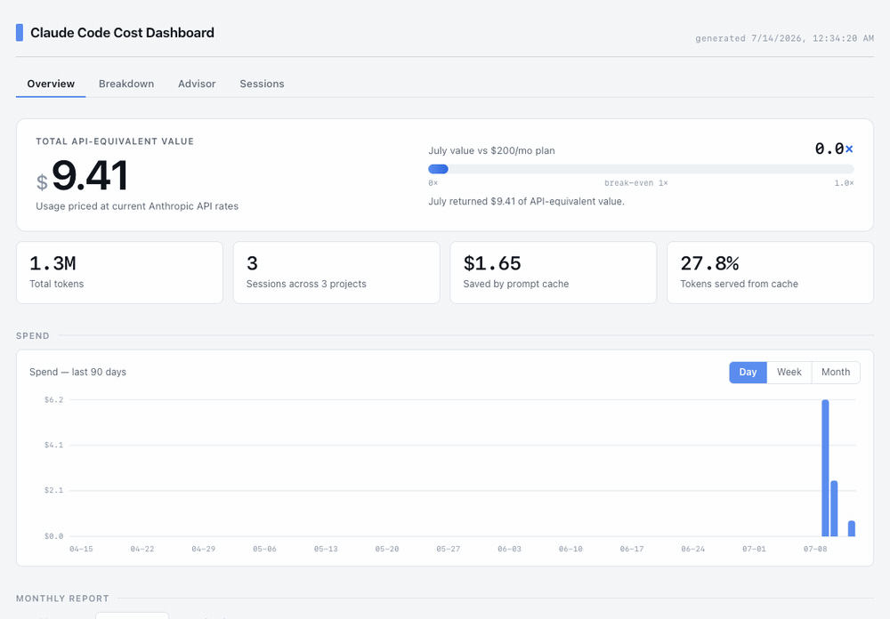
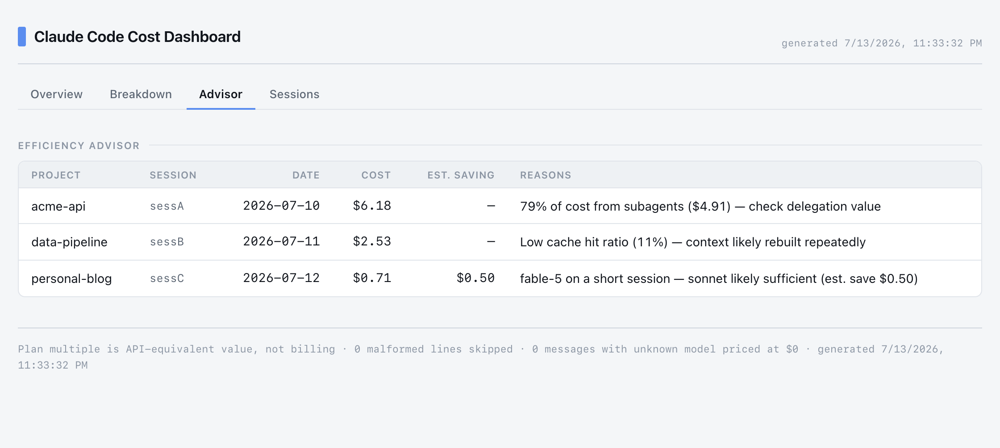
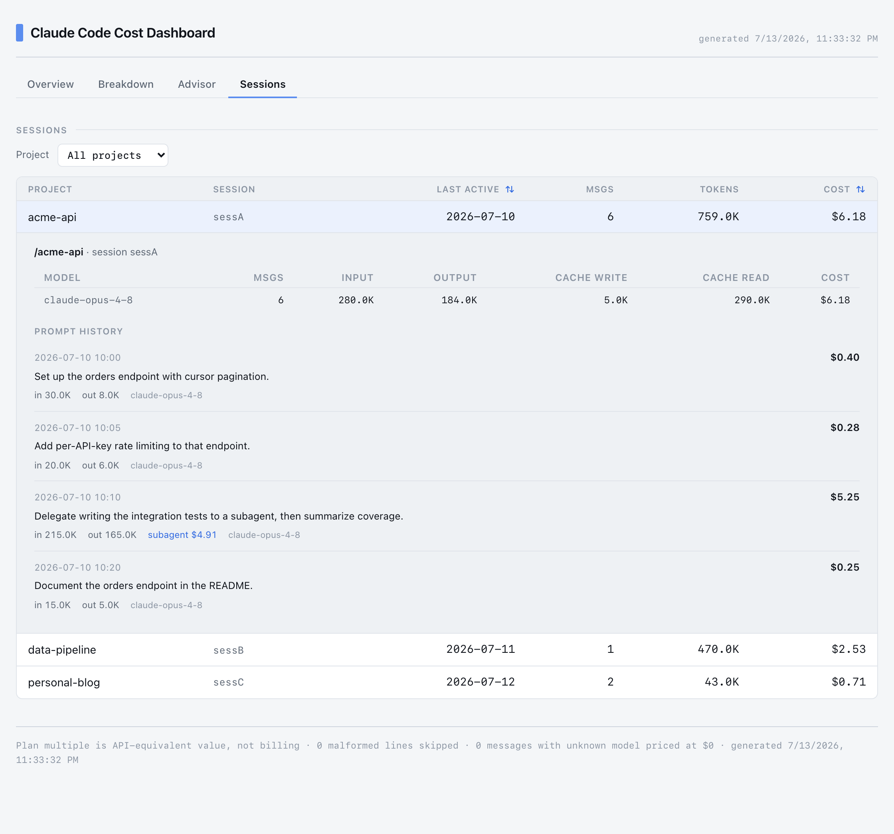

# Claude Code Cost Dashboard

[](https://www.npmjs.com/package/cccost-dashboard)
[](LICENSE)


A local, zero-setup dashboard that shows where your [Claude Code](https://claude.com/claude-code)
tokens and money go — per project, per model, and **per prompt**, over time — with
an efficiency advisor that flags where you're likely overspending.

It reads the session logs Claude Code already writes to `~/.claude/projects/`. No
API key, no proxy, no account, no data leaves your machine.

> **Unofficial.** Not affiliated with or endorsed by Anthropic. "Claude" and
> "Claude Code" are trademarks of Anthropic. Costs shown are *API-equivalent
> value* computed from local usage logs — on a Pro/Max subscription they are not
> what you are billed.



**Efficiency advisor** — flags likely overspend, per session:



**Per-prompt cost** — expand any session for a timeline of what each prompt cost,
including subagent work attributed to the triggering prompt:



> Screenshots use the bundled demo dataset (`demo/projects/`), not real data.

## Why this one

Most Claude Code cost tools are either live "fuel gauges" (ccusage, usage
monitors) or team/org platforms that need a proxy or gateway (LiteLLM, Bifrost,
Mavvrik). This one is aimed at a **solo developer or consultant on a subscription
plan** and focuses on attribution and advice:

- **Per-prompt cost** — expand any session to see what each individual prompt cost,
  including subagent work attributed to the right turn.
- **Spend over time** — a Day / Week / Month toggle on the spend chart, plus a
  monthly total report you can download.
- **Efficiency advisor** — computed-from-your-own-sessions flags (not generic
  blog advice) for likely waste, with dollar estimates.
- **Subagent accounting** — subagent and workflow-agent transcripts are merged into
  their parent session and their cost share is surfaced.

## Requirements

- Node.js **≥ 20.19** (uses `node --test` and recursive `fs.readdir`; the frontend
  build needs Vite 8 / React 19).

## Install

Run it without cloning:

```sh
npx cccost-dashboard                 # then open http://localhost:3456
```

Or install it globally:

```sh
npm install -g cccost-dashboard
cccost-dashboard
```

Refresh the page to pick up new sessions — only changed files are re-parsed.
Override the port with `PORT=4000 cccost-dashboard`.

### From source

```sh
git clone https://github.com/simantaturja/claude-code-cost-dashboard
cd claude-code-cost-dashboard
npm --prefix web install   # frontend deps (backend has none)
npm run build              # build the React app into web/dist
npm start                  # serve at http://localhost:3456
```

Try it against the bundled synthetic dataset (source checkout only — the demo data
isn't shipped in the npm package):

```sh
CLAUDE_PROJECTS_DIR=./demo/projects npm start
```

`CLAUDE_PROJECTS_DIR` overrides the default `~/.claude/projects` scan path.

### Frontend dev mode

```sh
cd web && npm run dev      # Vite dev server with hot reload
```

Run `npm start` in the repo root alongside it — the dev server proxies `/api` to
`http://localhost:3456` for live data.

## Configuration

Optional. Create a `config.json` in the directory you run `cccost-dashboard`
from, or at `~/.config/cccost-dashboard/config.json`:

```json
{
  "subscriptionUSDPerMonth": 200
}
```

- `subscriptionUSDPerMonth` — your plan price, used for the plan-ROI figure.
- With no `config.json`, ROI uses a $200 default.

## Features

| Tab | Shows |
|---|---|
| **Overview** | Total cost, tokens, cache savings, plan-ROI multiple, a spend chart with a Day/Week/Month toggle, and a monthly total report to download. |
| **Breakdown** | Cost by project and by model (with cache-read %). |
| **Advisor** | Sessions flagged for likely overspend (see below). |
| **Sessions** | Sortable session list; expand a row for a per-prompt timeline and per-model breakdown. Filter by project. |

## How the efficiency advisor works

Each session runs through `advisorFor` (`lib/core.js`). A session can trip several
rules; only flagged sessions are returned, sorted by cost and capped at 25. The
thresholds are hand-picked heuristics — treat the output as a "look here first"
signal, not a verdict.

| Rule | Fires when | Meaning |
|---|---|---|
| Low cache hit ratio | cost ≥ $1 **and** cache-read < 50% of input-side tokens | Context rebuilt instead of served from cache (reads are ~10× cheaper). |
| Premium model, short session | used `fable-5` **and** < 20 messages | A short session rarely needs the most expensive model. Est. saving = `fableCost × 0.7`. |
| Subagent-heavy | cost ≥ $5 **and** subagents > 60% of cost | Fan-out overhead — check the delegation earned its cost. |

Only the premium-model rule estimates dollars. Known limits: a low cache ratio is
often not your fault (5-minute cache TTL, `/clear`, idle gaps); the Sonnet-saving
estimate assumes the task would have succeeded on Sonnet; the cutoffs will produce
some false positives.

## How costs are computed

- **Source** — one JSONL file per session under `~/.claude/projects/`; assistant
  messages carry `usage`. Subagent files under a session's directory are merged in.
- **Pricing** — a table in `lib/core.js` (`PRICING`), USD per 1M tokens. Cache
  writes are priced per TTL (5-minute = 1.25× input, 1-hour = 2× input); cache
  reads at 0.1× input. Update the table when Anthropic pricing changes.
- **Dedup** — streaming writes the same `message.id` multiple times; the last
  (complete) occurrence wins.
- **Time** — days and months bucket by the machine's **local** calendar date, so
  billing months follow wall-clock time, not UTC.
- **Unknown models** — priced at $0 and counted in the diagnostics footer.

## API

The server also exposes JSON/markdown endpoints directly:

| Endpoint | Returns |
|---|---|
| `GET /api/data` | Full aggregated payload (summary, byProject, byModel, daily, monthly, roi, advisor, sessions). Prompt text is **not** included. |
| `GET /api/report?month=YYYY-MM` | Markdown monthly total summary (cost + tokens). Defaults to the current month. |
| `GET /api/session?key=<sessionKey>` | Per-prompt timeline for one session, read from disk on demand. |

## Privacy

Everything runs locally. The server reads your Claude Code logs from disk and
serves them to `localhost` only. No API key, no telemetry, no outbound network
calls. Your real `config.json` (with client names/paths) is gitignored.

## Testing

```sh
npm test        # node --test — pure aggregation logic in lib/core.js
```

## Contributing

Issues and PRs welcome. Keep the backend dependency-free (`lib/core.js` and
`server.js` use only Node built-ins) and add a test in `test/core.test.js` for any
change to cost math or aggregation. See [docs/DESIGN.md](docs/DESIGN.md) for how
the cost model, dedup, subagent merge, and advisor work.

## License

[MIT](LICENSE) © 2026 Simanta Deb Turja
